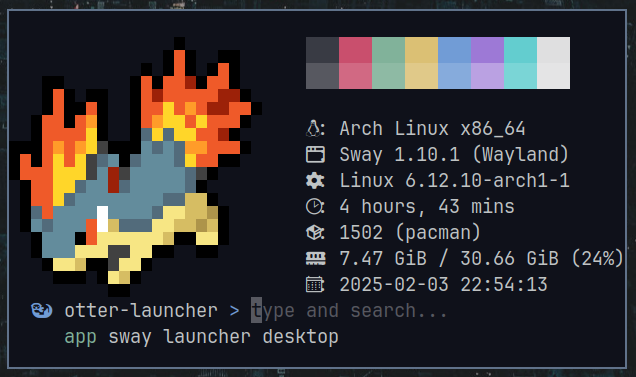

# Otter Launcher


Otter-launcher is a highly extendable cli program that can launch shell scripts or arbitrary commands by a few key strokes. It is customizable with ascii color code, sixel or kitty image protocol (depending on your emulator), and hence a good companion to keyboard-centric window manager users.

The concept is making behaviours like the below possible:

- type "gg margaret thatcher" to google the lady
- type "sh htop" to run htop in a terminal
- type "dc linux" to search the word linux with an online dictionary
- type "app" to launch sway-launcher-desktop
- etc.

It is recommended to use otter-launcher with [sway-launcher-desktop](https://github.com/Biont/sway-launcher-desktop), making it an application launcher. Use your wm's window rules to control its window size. 


# Features

- modularized prefixes to run different commands (via configuration)
- fuzzy search and tab completion for configured modules
- url encoding for web searching use
- cutomizable with ascii color codes, chafa, neofetch, etc.
- minimalist, keyboard-centric design

# Installation

## Building from source

```
git clone https://github.com/kuokuo123/otter-launcher /tmp/otter-launcher
cd /tmp/otter-launcher
cargo build --release
sudo cp /tmp/otter-launcher/target/release/otter-launcher /usr/bin/
```

# Configuration

Otter-launcher read a config file from $HOME/.config/otter-launcher/config.toml. If that file is missing, it looks into /etc/otter-launcher/config.toml

``` toml
[general]
default_module = "gg" # The module to run when no prefix is matched; leaving the option empty defaults to googling
empty_module = "" # The module to run with an empty prompt
exec_cmd = "swaymsg exec" # The exec command of your window manager; change it to "hyprctl dispatch exec" if you use hyprland
show_suggestion = true # Fuzzy search for prefixes; autocompletion with TAB


[interface]
# ASCII color codes are allowed with these options. However, \x1b[ should be replaced with \u001B[ (unicode escape) because the rust toml crate cannot read \x as an escaped character...
header_cmd = "" # Run a shell command and make the stdout printed above the header
header_cmd_trimmed_lines = 0 # Remove a number of lines from header_cmd output, in case of some programs printing excessive empty lines at the end of its output
header = ""
prompt_prefix = " \u001B[34m \u001B[0m otter-launcher \u001B[34m>>\u001B[0m"
list_prefix = "  \u001B[34m>>\u001B[0m"
highlighted_prefix = "  \u001B[34m#>\u001B[0m"
scroll_up_prefix = "  \u001B[34m#!\u001B[0m"
scroll_down_prefix = "  \u001B[34m#!\u001B[0m"
help_message = ""
place_holder = "type and search..."
suggestion_lines = 1


# Modules are defined as followed
[[modules]]
description = "search for arch packages"
prefix = "\u001B[32mpac\u001B[0m"
cmd = "xdg-open https://archlinux.org/packages/?q='{}'"
with_argument = true # If "with_argument" is true, the {} in the cmd value will be replaced with user input. For example, entering "sh yazi ~/downloads" will open yazi and enter the download folder when "with_argument" is true; but will not enter ~/downloads when "with_arguement" is false.
url_encode = true # The url_encode option should be set true when the module is set to call for webpages, as it will make sure special characters in the url being readable to web browsers. It will better be false when the module calls a shell script.

[[modules]]
description = "search archwiki"
prefix = "\u001B[32maw\u001B[0m"
cmd = "xdg-open https://wiki.archlinux.org/index.php?search='{}'"
with_argument = true
url_encode = true

[[modules]]
description = "search with google"
prefix = "\u001B[32mgg\u001B[0m"
cmd = "xdg-open 'https://www.google.com/search?q={}'"
with_argument = true
url_encode = true

[[modules]]
description = "search youtube"
prefix = "\u001B[32myt\u001B[0m"
cmd = "xdg-open 'https://www.youtube.com/results?search_query={}'"
with_argument = true
url_encode = true

[[modules]]
description = "cambridge dictionary online"
prefix = "\u001B[32mdc\u001B[0m"
cmd = "xdg-open 'https://dictionary.cambridge.org/dictionary/english/{}'"
with_argument = true
url_encode = true

[[modules]]
description = "open files with fzf"
prefix = "\u001B[32mfo\u001B[0m"
cmd = "$TERM -e sh -c 'fd --type f | fzf -0 -1 --padding 1,3 | xargs setsid -f xdg-open'"
with_argument = false
url_encode = false

[[modules]]
description = "search for directories with yazi"
prefix = "\u001B[32myz\u001B[0m"
cmd = "$TERM -e sh -c 'fd --type d $FD_OPTIONS | fzf -0 -1 --padding 1,3 | xargs setsid -f $TERM -e yazi'"
with_argument = false
url_encode = false
```

# Examples for Styling

## Default


```
[interface]
header_cmd = ""
header_cmd_trimmed_lines = 0
header = ""
prompt_prefix = " \u001B[34m \u001B[0m otter-launcher \u001B[34m>\u001B[0m"
list_prefix = "    "
highlighted_prefix = "    "
scroll_up_prefix = "    "
scroll_down_prefix = "    "
help_message = ""
place_holder = "type and search..."
suggestion_lines = 1
```

## Pfetch Integration


```
[interface]
header_cmd = "echo ' '; pfetch"
header_cmd_trimmed_lines = 2
header = """
               \u001B[30m———\u001B[0m\u001B[31m———\u001B[0m\u001B[32m———\u001B[0m\u001B[33m———\u001B[0m\u001B[34m———\u001B[0m\u001B[35m———\u001B[0m\u001B[36m———\u001B[0m\u001B[37m———\u001B[0m
"""
prompt_prefix = " \u001B[34m \u001B[0m otter-launcher \u001B[34m>\u001B[0m"
list_prefix = "    "
highlighted_prefix = "    "
scroll_up_prefix = "    "
scroll_down_prefix = "    "
help_message = ""
place_holder = "type and search..."
suggestion_lines = 1
```

## Fastfetch & Krabby Integration



```
[interface]
header_cmd = "fastfetch --structure break:colors:break:os:wm:kernel:uptime:packages:memory:datetime:break --key-type icon --logo-type data --logo \"$(krabby name quilava --no-title)\""
header_cmd_trimmed_lines = 1
header = ""
prompt_prefix = " \u001B[34m \u001B[0m otter-launcher \u001B[34m>\u001B[0m"
list_prefix = "    "
highlighted_prefix = "    "
scroll_up_prefix = "    "
scroll_down_prefix = "    "
help_message = ""
place_holder = "type and search..."
suggestion_lines = 1
```

## Kitty + Uwufetch


```
[interface]
header_cmd = "uwufetch -i otter.png"
header_cmd_trimmed_lines = 3
header = """
               \u001B[30m———\u001B[0m\u001B[31m———\u001B[0m\u001B[32m———\u001B[0m\u001B[33m———\u001B[0m\u001B[34m———\u001B[0m\u001B[35m———\u001B[0m\u001B[36m———\u001B[0m\u001B[37m———\u001B[0m
"""
prompt_prefix = " \u001B[34m \u001B[0m otter-launcher \u001B[34m>\u001B[0m"
list_prefix = "    "
highlighted_prefix = "    "
scroll_up_prefix = "    "
scroll_down_prefix = "    "
help_message = ""
place_holder = "type and search..."
suggestion_lines = 1
```
